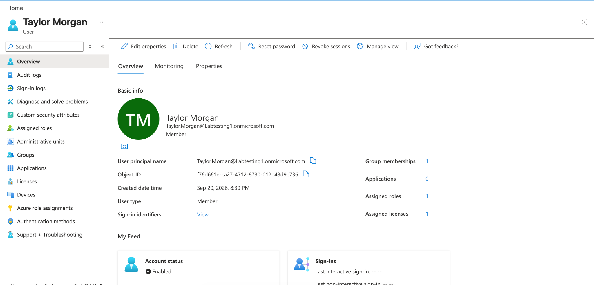
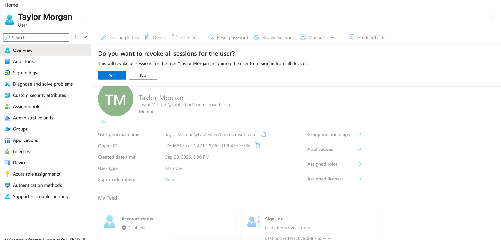
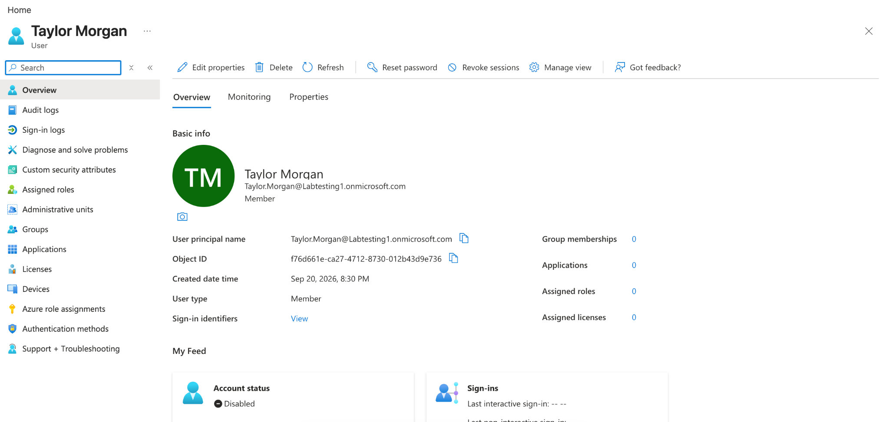

# Microsoft Entra ID Identity Lifecycle Management

## Objective

Practice a user offboarding workflow in Microsoft Entra ID by removing access, disabling the account, revoking sessions, and verifying the final state.

## Step 1: Review the User Before Offboarding

Reviewed **Taylor Morgan's** account and confirmed the user had active access before beginning the offboarding process.

## Step 2: Remove User Access

Removed the user's security group membership, directory role, and Microsoft Entra ID P2 license, then disabled the account.

## Step 3: Revoke User Sessions

Revoked the user's active sessions as part of the offboarding process.

## Step 4: Verify the Offboarded Account

Confirmed that the account was disabled and that group memberships, assigned roles, and licenses were reduced to zero.

## Skills Demonstrated

- Microsoft Entra ID
- Identity Lifecycle Management
- User Offboarding
- Access Removal
- Session Revocation
- Account Verification
